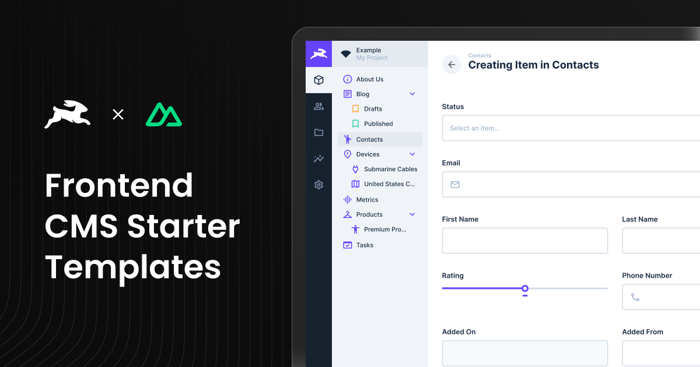

# Nuxt 3 CMS Template with Directus Integration

<div align="center">
  
</div>

This is a **Nuxt 3-based CMS Template** that is fully integrated with [Directus](https://directus.io/), offering a CMS
solution for managing and delivering content seamlessly. The template leverages modern technologies like **Nuxt 3's
file-based routing system**, **Tailwind CSS**, and **Shadcn Vue components**, providing a complete and scalable starting
point for building CMS-powered web applications.

## **Features**

- **Nuxt 3 File-Based Routing**: Uses Nuxt's built-in routing system with dynamic page handling.
- **Full Directus Integration**: Directus API integration for fetching and managing relational data.
- **Tailwind CSS**: Fully integrated for rapid UI styling.
- **TypeScript**: Ensures type safety and reliable code quality.
- **Shadcn Vue Components**: Pre-built, customizable UI components for modern design systems.
- **ESLint & Prettier**: Enforces consistent code quality and formatting.
- **Dynamic Page Builder**: A page builder interface for creating and customizing CMS-driven pages.
- **Preview Mode**: Built-in draft/live preview for editing unpublished content.
- **Optimized Dependency Management**: Project is set up with **pnpm** for faster and more efficient package management.

---

## **Why pnpm?**

This project uses `pnpm` for managing dependencies due to its speed and efficiency. If you’re familiar with `npm`,
you’ll find `pnpm` very similar in usage. You can still use `npm` if you prefer by replacing `pnpm` commands with their
`npm` equivalents.

---

## **Draft Mode in Directus and Live Preview**

### **Draft Mode Overview**

Directus allows you to work on unpublished content using **Draft Mode**. This Nuxt 3 template is configured to support
Directus Draft Mode out of the box, enabling live previews of unpublished or draft content as you make changes.

### **Live Preview Setup**

[Directus Live Preview](https://docs.directus.io/guides/headless-cms/live-preview/nuxt-3.html#set-up-live-preview-with-nuxt-3)

- The live preview feature works seamlessly on deployed environments.
- To preview content on **localhost**, deploy your application to a staging environment.
- **Important Note**: Directus employs Content Security Policies (CSPs) that block live previews on `localhost` for
  security reasons. For a smooth preview experience, deploy the application to a cloud environment and use the
  deployment URL for Directus previews.

### **Admin Bar**

Allows authenticated users to easily navigate to their **Directus instance** to edit or create pages and posts directly
from the frontend.

#### How It Works

By appending `?preview=true` to the URL, users enter **Admin Mode**, which:

- Displays an admin bar at the top of the page.
- Allows easy navigation to **edit** or **create** new posts/pages in Directus.
- Requires authentication to access edit and new content buttons.

#### Usage

To enable the **Admin Bar**, simply append `?preview=true` to any URL:

```plaintext
https://yourwebsite.com/blog/some-post?preview=true
```

---

## **Getting Started**

### Prerequisites

To set up this template, ensure you have the following:

- **Node.js** (16.x or newer)
- **npm** or **pnpm**
- Access to a **Directus** instance ([cloud or self-hosted](../../README.md))

## ⚠️ Directus Setup Instructions

For instructions on setting up Directus, choose one of the following:

- [Setting up Directus Cloud](https://github.com/directus-labs/starters?tab=readme-ov-file#using-directus-with-a-cloud-instance-recommended)
- [Setting up Directus Self-Hosted](https://github.com/directus-labs/starters?tab=readme-ov-file#using-directus-locally)

## 🚀 One-Click Deploy

You can instantly deploy this template using one of the following platforms:

[](https://vercel.com/new/clone?repository-url=https://github.com/directus-labs/starters/tree/main/cms/nuxt&env=DIRECTUS_URL,NUXT_PUBLIC_SITE_URL,DIRECTUS_SERVER_TOKEN,NUXT_PUBLIC_ENABLE_VISUAL_EDITING)

[](https://app.netlify.com/start/deploy?repository=https://github.com/directus-labs/starters&branch=main&create_from_path=cms/nuxt)

### **Environment Variables**

To get started, you need to configure environment variables. Follow these steps:

1. **Copy the example environment file:**

   ```bash
   cp .env.example .env
   ```

2. **Update the following variables in your `.env` file:**

   - **`DIRECTUS_URL`**: URL of your Directus instance.
   - **`DIRECTUS_SERVER_TOKEN`**: Public token for accessing public resources in Directus. Use the token from the
     **Webmaster** account.
   - **`DIRECTUS_FORM_TOKEN`**: Token from the **Frontend Bot User** account in Directus for handling form submissions.
   - **`NUXT_PUBLIC_SITE_URL`**: The public URL of your site. This is used for SEO metadata and blog post routing.
   - **`NUXT_PUBLIC_ENABLE_VISUAL_EDITING`**: Enable or disable visual editing in Directus

## **Running the Application**

### Local Development

1. Install dependencies:

   ```bash
   pnpm install
   ```

   _(You can also use `npm install` if you prefer.)_

2. Start the development server:

   ```bash
   pnpm run dev
   ```

3. Visit [http://localhost:3000](http://localhost:3000).

## Generate Directus Types

This repository includes a [utility](https://www.npmjs.com/package/directus-sdk-typegen) to generate TypeScript types
for your Directus schema.

#### Usage

1. Ensure your `.env` file is configured as described above.
2. Run the following command:
   ```bash
   pnpm run generate:types
   ```

## Folder Structure

```
app/                          # Main Nuxt application folder
│
├── assets/                   # Static assets like images and stylesheets
│   ├── css/
│   ├── images/
│
├── components/               # Vue components
│   ├── base/                 # Common reusable base components
│   ├── block/                # CMS-driven blocks like Hero, Gallery, etc.
│   ├── forms/                # Form components and field inputs
│   │   ├── fields/
│   ├── shared/               # Shared utilities like AdminBar, DirectusImage
│   ├── ui/                   # Shadcn UI components
│   ├── Footer.vue
│   ├── NavigationBar.vue
│   ├── PageBuilder.vue       # Assembles CMS-driven blocks into pages
│
├── layouts/                  # Nuxt layouts for structuring pages
│   ├── default.vue
│
├── lib/                      # Utility functions and helper scripts
│   ├── zodSchemaBuilder.ts   # Schema validation with Zod
│
├── pages/
│   ├── blog/
│   │   ├── [slug].vue        # Dynamic blog post route
│   ├── [...permalink].vue    # Catch-all route for dynamic pages
│
├── public/                   # Publicly accessible assets
│   ├── icons/
│   ├── images/
│
├── scripts/
│   ├── generate-types.ts     # Script to generate Directus types
│
├── server/
│   ├── api/                  # API routes for interacting with Directus
│   │   ├── forms/submit.ts    # Handles form submissions
│   │   ├── posts/[slug]/index.ts  # Fetches individual posts
│   │   ├── search/index.ts    # Search functionality
│   │   ├── users/[id].ts      # Fetches user data
│   │   ├── authenticated-user.ts  # Auth check endpoint
│   ├── utils/                 # Backend utilities
│   │   ├── directus-server.ts # Directus server-side utilities
│   │   ├── directus-utils.ts  # General Directus helpers
│   ├── shared/                # Shared backend logic
│   │   ├── types/schema.ts    # Directus schema types
```
